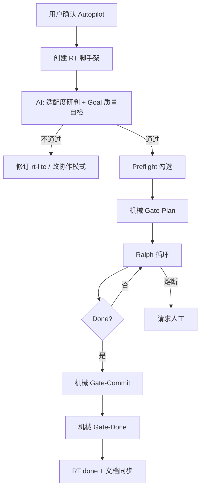

# AODW Autopilot 执行协议

> 版本 1.0 | 融合 Task Platform 持续编程实践与 AODW RT 体系  
> 关联：`autopilot-goal-spec.md`、`spec-lite-autopilot-profile.md`、`rt-manager.md` §3.2

---

## 0. 设计原则

| 原则 | 含义 |
|------|------|
| **规格驱动** | `rt-lite.md` + `rt-plan.md` 是每轮迭代的「大脑」，从磁盘重读，不靠对话记忆 |
| **文件系统即记忆** | `state.json` 跨轮持久化；每次迭代可全新 AI 上下文 |
| **机械 Backpressure** | 改动后必须跑 tests/lint/guard，禁止凭感觉声称完成 |
| **可观测** | `execution-log.md` 每轮一条，避免 RT-002 式黑盒 |
| **智能但可熔断** | LLM 负责研判与拆解；卡住/超轮/无进展则交还人工 |
| **用户已确认模式** | `execution_mode` 仅在创建 RT 时由用户选定，AI 不得静默默认 |

---

## 1. 生命周期总览



---

## 2. 阶段说明

### Phase A — 模式确认（强制，RT 创建时）

见 `rt-manager.md` §3.2、`ai-interaction-rules.md`。未获用户 A/B 答复前不得创建 `RT/RT-XXX/`。

### Phase B — Goal 定稿（AI + 用户，可 1–2 轮对话）

1. AI 根据 intake 起草 `rt-lite.md` §1-§4、§7、§5.4
2. 运行 `autopilot-goal-spec.md` §5 质量自检 + §6 适配度
3. 不通过 → 用决策型问题请用户收窄范围或改协作模式
4. 通过 → 初始化 `state.json`、`rt-plan.md`（空计划）

**友好行为**：用自然语言向用户展示 §7 摘要（3–5 条），请用户确认「是否就是这些完成标准」；仅确认后写入终稿。

### Phase C — Preflight

完成 `rt-autopilot-preflight.template.md` 或 `rt-autopilot-readiness.md` 全部勾选。

### Phase D — 机械 Gate-Plan（替代协作 Gate 3）

| 条件 | 检查方式 |
|------|----------|
| §1-§4、§7 非空且通过 Goal 自检 | 文档 + AI 清单 |
| §5.4 三条命令已填且可执行 | 试跑或 `--help` 可解释 |
| 已在 `feature/RT-XXX-*` 分支 | `git branch --show-current` |

通过 → `state.json.checklist.plan_complete=true`，`phase=implementing`。

### Phase E — Ralph 实现循环

每轮四步（与 Task Platform §4.2 对齐）：

1. **Read** — `state.json` + `rt-plan.md` + `loop-prompt.md`（注入当前 iteration）
2. **Execute** — 完成 `rt-plan.md` 中 1–2 个未完成步骤；对应推进 §7 checklist
3. **Backpressure** — 跑 §5.4 tests → lint → guard；更新 checklist 布尔值
4. **Write** — 更新 `state.json`、`rt-plan.md`、`execution-log.md`；必要时 `rt-lite.md` §5-§6

**迭代上限**：`max_iterations` 默认 **20**（与 Task Platform `MAX_ITERATIONS` 一致；Spec-Lite 单 RT 可协商降为 15）。写在 `state.json`，创建 RT 时可与用户确认。

**冷却**：连续 API/工具失败时，记录 `blockers`，下一轮再试（不在单轮内死磕 >3 次同一错误）。

### Phase F — 机械 Gate-Commit（替代协作 Gate 4）

全部满足才允许 `git commit`：

- `tests_pass` && `lint_pass` && `guard_pass`
- 本轮 diff 与 §2.1 范围一致（guard 辅助）

### Phase G — 机械 Gate-Done（替代协作 Gate 5）

**双条件完成**（对齐 Task Platform Goal Spec §三、Ralph「计划清空 + 验证通过」）：

1. `rt-plan.md`「进度」区全部 `[x]`（无 `[ ]` 步骤）
2. `state.json.checklist` 全 `true`，且 §5.4 tests/lint/guard 均已在本轮或上一轮验证通过

另需：

- development auditor 无 P0
- `meta.yaml.status=done`，`state.json.phase=done`
- 输出 `DONE`（对齐 Ralph 完成信号，便于外部脚本检测）

**机械 Stop 映射**：`guard` + pre-commit hook ≈ Task Platform Stop Hook；不得以纯对话判定替代上述双条件。

---

## 3. 质量控制

### 3.1 每轮 Quality Gate

- [ ] 代码可解析/编译
- [ ] 相关测试通过
- [ ] lint/type 无新增错误
- [ ] 改动范围 ≤ 本轮 `rt-plan.md` 目标
- [ ] `state.json` 已更新
- [ ] `execution-log.md` 已追加本条

### 3.2 Final Gate

- [ ] 所有 §7 条件已验证
- [ ] 完整测试套件（非抽样）通过
- [ ] 无临时 debug / 大范围 commented-out
- [ ] 无新增未说明的 TODO（除非原有问题）
- [ ] `phase=done`

### 3.3 反模式检测（AI 每轮自检）

| 信号 | 含义 | 处理 |
|------|------|------|
| 同一文件修改 > 3 次 | 方案可能错误 | 换实现，记入 `decisions` |
| 同一测试点连续失败 | 理解有误 | 重读 §1、模块 README，更新 `blockers` |
| checklist 2 轮无进展 | 任务过大 | 拆 `rt-plan.md` 子步骤或 `phase=blocked` |
| diff 出现 §2.1 外文件 | scope creep | 回滚无关改动，收紧 prompt |
| 新增「过度烘焙」功能 | 循环过久/目标模糊 | 停止迭代，收紧 §7 或改协作模式 |

---

## 4. 执行子模式（AI 自主选用）

在 **已确认 Autopilot** 的前提下，AI 根据任务特征选择子模式（**无需再次问用户**，但须写入 `state.json.execution_submode`）：

```
任务评估
  │
  ├─ 预计多轮、>100K token、需跨重启续接？
  │   └─ 是 → ralph-loop（默认）：每轮新上下文，读 state.json
  │
  ├─ 可在单 session 内完成且 §7 ≤5 条？
  │   └─ 是 → goal-session：单 session 推进，仍须机械验收
  │
  └─ 默认 → ralph-loop
```

| 子模式 | 适用 | 风险缓解 |
|--------|------|----------|
| `ralph-loop` | 多步骤、长任务、需断点续跑 | `state.json` + `execution-log` |
| `goal-session` | 小改动、明确终点 | 仍跑 §5.4；避免「Evaluator 式」纯对话判定 |

---

## 5. 与用户交互边界（智能友好）

### 5.1 不打断用户

- 每轮实现、测试、更新 state
- 自动 commit（Gate-Commit 通过后）
- 文档 §5-§6 同步

### 5.2 必须打断用户

1. `blockers` 非空且 **2 轮**无法消除
2. 产品/架构 **二选一**（无默认安全项）
3. 熔断：无进展 2 轮 / 达 `max_iterations` / 适配度中途恶化（如出现 schema 变更）
4. Goal 自检失败且用户不愿收窄范围

### 5.3 进度友好（推荐）

每 **3 轮**或 **phase 变化**时，向用户发送简短进度（非请求确认）：

```
[RT-012 Autopilot] 迭代 3/15 | phase=implementing
✓ C2 tests  ✓ C3 lint  ○ C5 docs
下一步：更新 §6 changelog
```

---

## 6. 错误恢复

| 场景 | 行为 |
|------|------|
| 单轮工具/测试失败 | 记入 `blockers`，下轮续接；**不**整 RT 失败 |
| 上下文耗尽 | 下轮全新上下文，读 `state.json` |
| 用户中断 | 保留 `state.json`，下次从 checklist 续跑 |
| 需改协作模式 | 更新 `meta.yaml.execution_mode=collaborative`，记录 `decisions`，交还 Gate 3/4/5 |

---

## 7. 配置参考

| 参数 | 默认 | 说明 |
|------|------|------|
| `max_iterations` | 20 | 防无限循环 / 过度烘焙（可对小型 RT 降为 15） |
| `stall_threshold` | 2 | 连续无进展轮数 → blocked |
| `same_file_edit_limit` | 3 | 反模式熔断 |
| `progress_notify_every` | 3 | 可选进度摘要间隔 |

---

## 8. 开工自检（AI）

- [ ] 用户已确认 `execution_mode: autopilot`
- [ ] Goal 质量自检 7/7 通过
- [ ] Autopilot 适配度 ≥ 4/6（或用户坚持并已知晓风险）
- [ ] Preflight 完成
- [ ] `feature/RT-XXX` 分支
- [ ] `loop-prompt.md` iteration 已设为 1

---

## 9. 文件清单

```
RT/RT-XXX/
  meta.yaml              # execution_mode: autopilot
  decision.md            # 含模式确认记录
  rt-lite.md             # Goal：§1-§7
  rt-plan.md             # Plan：动态步骤
  state.json             # 机器状态
  loop-prompt.md         # 轮次 prompt
  execution-log.md       # 人读时间线
  autopilot-preflight.md # 开工许可
```

---

## 10. 参考

- Task Platform: `docs/continuous-programming-protocol.md`
- Task Platform: `docs/goal-specification-standard.md`
- AODW: `spec-lite-autopilot-profile.md`、`autopilot-goal-spec.md`
